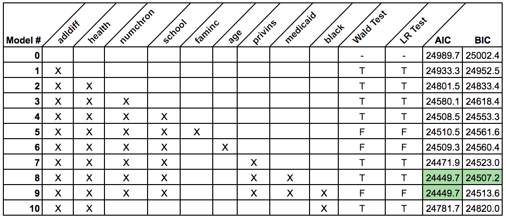

```{r setup, include=FALSE}
knitr::opts_chunk$set(echo = TRUE)
library(knitr)
library(AER)
library(MASS)
library(broom)
library(pscl)
library(lmtest)
library(visdat)
```

### Objective

Find a dataset with a non-continuous response variable and at least seven explanatory variables (at least two of them categorical). Use the techniques learned in the Generalized Linear Models course (MATH 6622) to analyze the data and report the statistical results.

The data are obtained from the US National Medical Expenditure Survey (NMES) which was conducted in 1987 and 1988 to provide a comprehensive picture of how Americans use and pay for health services. We consider a subsample of individuals ages 66 and over all of whom are covered by Medicare, a public insurance programme that offers substantial protection against health care costs in the United States. This data is taken from the paper **Demand for Medical Care by the Eldery: A Finite Mixture Approach** by Partha Deb and Pravin K. Trivedi.

##### Model Response

We attempt to model the **number of non-hospital physician office visits over the course of a year** for the observed seniors, predicted both in terms of personal characteristic variables like age, minority status and income, as well as some other macro-variables like the region of the United States in which each senior resides. 

In this project, we will be working from a predictive standpoint and will try to attain the leanest possible model to model the number of physician visits, and will not attempt to model the causal effect relationship between the predictors and the response. 

### Data Directory

The dataset provided includes 4406 observations and 22 variables including our response. All the observations will be used, but only a subset of the predictors will be included in our analysis.

The variables correspond to measurements of counts and personal characterstics in the year 1987, and can be described as follows:


**`ofp`**: number of physician office visits in the measured year **(our response count variable)**

**`health`**: categorical variable measuring self-perceived health level (can take values `poor`, `average` or `excellent`)

**`numchron`**: number of chronic health conditions the person surveyed has (including cancer, previous heart attack, gall bladder problems, emphysema, arthritis, diabetes, or other heart diseases)

**`adldiff`**: categorical variable measuring whether or not the person has a condition that limits the activities of daily living (can take values `no` or `yes`)

**`region`**: categorical variable that states the geographical region of the United States in which the person lives (can take values `noreast`, `midwest`, `west` or `other`)

**`age`**: $(\text{age in years})\times 10^{-1}$ of the person

**`black`**: categorical variable stating whether or not the person is of African American heritage (can take values `no` or `yes`)

**`gender`**: categorical variable stating whether the person is male or female (can take values `male` or `female`)

**`married`**: categorical variable stating whether or not the person is married (can take values `no` or `yes`)

**`school`**: number of years of education of the person

**`faminc`**: $(\text{yearly income}) \times \$ 10,000^{-1}$ of the household of the person

**`employed`**: categorical variable stating whether or not the person is employed (can take values `no` or `yes`)

**`privins`**: categorical variable stating whether or not the person is covered by private health insurance (can take values `no` or `yes`)

**`medicaid`**: categorical variable stating whether or not the person is covered by Medicaid (can take values `no` or `yes`)

This still leaves us with all 4406 observations but reduces the number of variables to 14.

```{r include = T, echo = F, warning=FALSE, message=FALSE}
sum_table <- read.csv('Summary Table Final.csv')
kable(sum_table)
```

### Exploratory Data Analysis

##### Data Cleaning

First, we load in the data and take a look at the first few observations (note that the following table is interactive and scrollable):

```{r, echo=FALSE}
set.seed(1337)

load('DebTrivedi')
df <- DebTrivedi[ , c(1, 7:19)]
remove(DebTrivedi)

## Interactive Table (Scroll right and left)
head(df)
```

All of the variables seem to be in a workable state - although some data cleaning can idealize the dataset. We will change all of the two-factor categorical variables, including `adldiff`, `black`, `gender`, `married`, `employed`, `privins`, and `medicaid` into logical variables.

**Note**: the variable name for `gender` was changed to `male` when it was translated into a logical variable for easy interpretation.

Let's take a look at the state of missingness in the data set:

```{r, echo=FALSE}


if (!is.logical(df$adldiff)){
## adldiff
df$adldiff <- as.logical(as.numeric(df$adldiff) - 1)

## black
df$black <- as.logical(as.numeric(df$black) - 1)

## gender (true = male, name change to male instead of gender)
df$gender <- as.logical(as.numeric(df$gender) - 1)

## married
df$married <- as.logical(as.numeric(df$married) - 1)

## employed 
df$employed <- as.logical(as.numeric(df$employed) - 1)

## privins 
df$privins <- as.logical(as.numeric(df$privins) - 1)

## medicaid 
df$medicaid <- as.logical(as.numeric(df$medicaid) - 1)

# change name of gender to male
varnames <- names(df)
varnames[8] <- 'male'
names(df) <- varnames
}

print("How many NA's are in each column?")
t(data.frame("NA.Freq" = colSums(is.na(df))))
```

It looks like we don't have any missing values, which is rare for medical data, but it is great for our analysis nonetheless.

##### Baseline Generalized Linear Model

When dealing with count data as a response variable, it is natural to first approach modelling the data using Poisson regression and the log-link function.

Identifying if the response variable is rate data or not is another important aspect in order to determine whether an offset is required in your model. In our case, as per the data description, all measurements were taken over the course of the year 1987, hence the counts are all over the same length of time and we do not require an offset in our model as our data is not rate data.

We will attempt to fit the full model to take a preliminary look:

```{r}
var <- c('health', 'adldiff', 'region', 'age', 'male', 'black', 
          'married', 'school', 'faminc', 'employed', 'privins', 'medicaid')
form <- as.formula(paste('ofp ~', paste(var, collapse = ' + ')))
pfit <- glm(form, data = df, family = poisson(link = 'log'))
tidy(pfit)
```

We can see that quite a few variables show strong statistical association with the response, but we should take a look at how the response variable `ofp` looks when compared to a vector of Poisson randomly generated values with the same means:

```{r}
## Output fitted values to use distribution plot
pfitted <- fitted(pfit)
```

```{r, echo=FALSE}
mui <- mean(df$ofp)
vari <- var(df$ofp)

dataplot2 <- function(x, lambda = lambda){
  poigen <- rpois(length(x), lambda = lambda)
  barplot(table(x), xlab = "Number of Physician Office Visits in 1987", ylim = c(0, 800),
          ylab = "Response Frequency", xlim = c(0, ifelse(length(unique(poigen))>=length(unique(x)), 
                                                 length(unique(poigen))+2, min(length(unique(x))+2, 24.9))),
          main = "Distribution Comparison of Response")
  if (length(unique(x))>=length(unique(poigen))){
    barplot(table(poigen), width=0.5, space=c(0.9, rep(1.4, length(unique(poigen))-1)), 
            col="red", add=TRUE, names.arg = "")
  } else {
    barplot(table(poigen), width=0.5, space=c(0.9, rep(1.4, length(unique(poigen))-1)), 
            col="red", add=TRUE, names.arg = c(rep("", length(unique(x))), (length(unique(x)) + 1):length(unique(poigen))))
  }
  legend(18, max(max(table(x)), max(table(poigen))) - 100, 
         legend=c("Data", expression(paste("Poisson Dist., ", lambda, " = ", mu[i]))),
         col=c("grey", "red"), pch= 15, cex = 0.8)
}

dataplot2(df$ofp, lambda = pfitted)
```

It's quite clear that `ofp` doesn't follow a regular Poisson distribution, and some peculiar characteristics of the response variable's distribution are evident in the plot. For the sake of convenience we let the random variable $X$ represent the `ofp` response. We note that the mean of `ofp` is $\lambda = E[X] = `r mui`$ on average, but the variance of the distribution on average is much higher than the mean, with $\text{Var}(X) = `r vari` \ne \lambda$. 

In a Poisson regression model, it's important that the mean of the Poisson output is equal to the variance. Sometimes, the variance is greater than the mean, which is called overdispersion, and we can see this visually in the plot by looking at the spread of the grey data, and how much further left and right of the red true distribution it spreads. This basically confirms that the regular Poisson regression of the data won't fit well, and we need to introduce the modelling of a second parameter, called the dispersion parameter, to properly model the data. Accounting for overdispersion in the response variable can be done by either fitting a negative binomial model or a quasi-poisson model to the data. Lastly, we will also consider a zero-inflated negative binomial model, as there appear to be a disproportionate number of zeros in the response.

### Quasi-Poisson or Negative Binomial?

In regular Poisson regression, a key assumption that's made is that the variance of the response variable is equal to the mean. If the response's variance is larger than its mean, the response is overdispersed, and either Negative Binomial regression or Quasi-Poisson regression should be used. Both quasi poisson and negative binomial models include a second parameter to separately model the relationship between the variance the mean.

In the Quasi-Poisson case, the variance follows a linear relationship with the mean. If $Y$ is our response variable, and $E[Y] = \mu$, then we have $\text{Var}(Y) = \theta \mu$, where $\theta$ is the Quasi-Poisson overdispersion parameter.

In the Negative binomial case, the variance follows a quadratic relationship with the mean. For example, if $E[Y] = \mu$, then we have $\text{Var}(Y) = \mu + \kappa \mu^2$, where $\kappa$ is the Negative Binomial dispersion parameter.

In order to decide which method is best, we have to look at the relationship between the means $\mu_i$ and the squared residuals of the regular poisson fit $(Y_i-\mu_i)^2$ in comparison with the two variance relationships. In order to do this, we first estimate both overdispersion parameters $\theta$ and $\kappa$ using `dispersiontest()` from `library(AER)`, which tests the null hypothesis of equidispersion in Poisson GLMs against the alternative hypothesis that there is overdispersion. The coefficient can be estimated by an auxiliary OLS regression and tested with the corresponding $t$ (or $z$) statistic which is asymptotically distributed as $N(0,1)$ under $H_0$ [see Cameron, A.C. and Trivedi, P.K. (1990)].

The test with parameter `trafo = 1` performs a statistical test on $H_0: \alpha = 0$ against the alternative $H_1: \alpha > 0$ where $\text{Var}(Y) = \theta \mu = (1+\alpha)\mu$ for overdispersion in the Quasi-Poisson case and provides an estimate of $\alpha$.

If we instead set `trafo = 2` performs a statistical test on $H_0: \alpha = 0$ against the alternative $H_1: \alpha > 0$ where $\text{Var}(Y) = \mu + \kappa \mu^2 = \mu + \alpha \mu^2$ for overdispersion in the Negative Binomial case and provides an estimate of $\alpha$:


```{r}
### Dispersion Test from library(AER)
qpdtest <- dispersiontest(pfit, trafo = 1)
nbdtest <- dispersiontest(pfit, trafo = 2)

### Dispersion Parameter Estimates
qpdisp <- 1 + qpdtest$estimate
nbdisp <- nbdtest$estimate

### Dispersion Test p-values
qpdispp <- qpdtest$p.value
nbdispp <- nbdtest$p.value

### Squared Residuals
presids <- (df$ofp - pfitted)^2

### Variance Functions
varqp <- function(mu){
  qpdisp * mu
}

varnb <- function(mu){
  mu + nbdisp * mu^2
}
```

In the Quasi-Poisson case, we estimate the dispersion parameter to be $\theta = `r qpdisp`$ and the relationship of the variance to the mean can be written as $\text{Var}(Y) = (1+`r qpdisp`) \mu$. With respect to the previously outlined test, we reject $H_0$ with associated $p\text{-value}= `r qpdispp`$, which means that there's extremely strong evidence that $\alpha >0$.

In the Negative Binomial case, we take the dispersion parameter to be $\kappa = `r nbdisp`$ and the relationship of the variance to the mean can be written as $\text{Var}(Y) = \mu + `r nbdisp` \mu^2$. With respect to the previously outlined test, we reject $H_0$ with associated $p\text{-value}= `r nbdispp`$, which means that there's extremely strong evidence that $\alpha > 0$.

We now take a look at the relationship between the squared residuals of the regular Poisson regression model and the means:


```{r, echo=FALSE}
meanvec <- Inf
sizes   <- Inf
uniques <- unique(round(pfitted, 1))

for (i in uniques){
  ind <- round(pfitted, 1) == i
  meanvec <- c(meanvec, mean(presids[ind]))
  sizes <- c(sizes, sum(ind))
}

meanvec <- meanvec[-1]
sizes   <- sizes[-1]

### Plot
plot(x = uniques, y = meanvec, ylim = c(0, 130), 
     xlab = expression(paste("Mean ", mu[i])), 
     ylab = expression(paste("Residuals ", (Y[i]-mu[i])^2)),
     main = 'Average Squared Residuals by Fitted Values',
     xlim = c(0, 15), cex = sqrt(sizes*200/(sum(sizes))))
curve(varqp, col = 'red', add = TRUE, lty = 'dashed', lwd = 2)
curve(varnb, col = 'blue', add = TRUE, lty = 'dashed', lwd = 2)
legend(11.5, 130, legend = c("Negative Binomial", "Quasi-Poisson"),
       col=c("blue", "red"), pch= 15, cex = 0.8)
```

The previous plot shows average squared residuals by fitted means. The fitted mean values were rounded to one decimal place and residual values that shared the same means were averaged. The size of the circles corresponds to the proportion (or the weight) of response values representing the same mean value. 

The red dashed line represents the linear relationship that the variance should follow if the model should be fit with a Quasi-Poisson family, and the blue dashed line represents the quadratic relationship that the variance should follow if the model should be fit with a Negative Binomial family. It's quite clear from the plot that a vast majority of the residuals follow the quadratic relationship much better than they do the linear relationship. For this reason, we will stick to the Negative Binomial family when fitting the model.

Using the full Negative Binomial model fit we used in the previous section, we can look at a new distribution plot using the Negative Binomial fitted values and see if the distribution comparison with the data is better:

```{r, echo = FALSE}
nbfit <- glm.nb(form, data = df)
nbfitted <- fitted(nbfit)

dataplot3 <- function(x, lambda, kappa){
  poigen <- rnbinom(length(x), mu = lambda, size = (1/kappa))
  barplot(table(x), xlab = "Number of Physician Office Visits in 1987", ylim = c(0, 800),
          ylab = "Response Frequency", xlim = c(0, ifelse(length(unique(poigen))>=length(unique(x)), 
                                                 length(unique(poigen))+2, min(length(unique(x))+2, 24.9))),
          main = "Distribution Comparison of Response")
  if (length(unique(x))>=length(unique(poigen))){
    barplot(table(poigen), width=0.5, space=c(0.9, rep(1.4, length(unique(poigen))-1)), 
            col="red", add=TRUE, names.arg = "")
  } else {
    barplot(table(poigen), width=0.5, space=c(0.9, rep(1.4, length(unique(poigen))-1)), 
            col="red", add=TRUE, names.arg = c(rep("", length(unique(x))), 
                                               (length(unique(x)) + 1):length(unique(poigen))))
  }
  legend(15, max(max(table(x)), max(table(poigen))) - 150, 
         legend=c("Data", "Negative Binomial Dist., ", 
                  expression(paste(" ", mu, " = ", mu[i], ", ", kappa, " = ", 1.01311))),
         col=c("grey", "red", "white"), pch= 15, cex = 0.8)
}

dataplot3(df$ofp, lambda = nbfitted, kappa = nbdisp)
```

It's quite clear that the Negative Binomial family fits the data much better than the ordinary Poisson distribution. This relationship can be seen visually in the above plot.

### Is a Zero-Inflated Model Appropriate?

In cases where there are a higher number of zero's than expected observed in the response variable, it is appropriate to consider a zero inflated model. Zero inflated models are a two-component mixture model combining a point mass at zero with a count distribution (E.g. Poisson, Negative Binomial). There are then two sources of zeros: from either the point mass or the count model. 

Zero inflated are typically used when there is another process outside of what is accounted in the original model that causes a response value of zero.
For example, in predicting the number of insurance claims submitted for a particular risk (e.g. flood), the counts may be zero inflated by those people who have not taken out an insurance policy for that particular risk and are therefore unable to submit a claim. The mixture model therefore has two components.

$\ Pr(y_{j} = 0) = \pi + (1-\pi)f(0)$
$\ Pr(y_{j} = h) = (1-\pi)f(h), \;\;\;h \ge 0$

Where $\pi$ is modeled by a binomial GLM $\pi = g^{-1}(Z^{T}\gamma)$

How does a zero-inflated model fit with our data? We examine this by fitting both a negative binomial and a zero inflated negative binomial on a subset of the most predictive variables.

```{r include = T, echo = T}
nbfit <- glm.nb(formula = ofp ~ adldiff + health + numchron + male + school, data = df)
zerofit <- zeroinfl(formula = ofp ~ adldiff + health + numchron + male + school , data = df, dist = 'negbin')

```
Using AIC as a rough metric to evaluate model fit, we see that $AIC_{NB} = 24501.5$ and $AIC_\text{Zero Inf} =24386.17$.  

It is difficult to use other metrics, such as  $BIC$ or $R^2$ as these do not apply to both model types. Despite the zero inflated model having a lower $AIC$, we believe it is not an appropriate choice for this analysis. The description of the dataset gives no indication that the data is not iid or that there is any kind of underlying process that would induce a response of zero (other than the variables and processes that are already accounted for). Additionally, is it expected that a zero inflated model would perform as well better than its non-inflated counter part. This is due simply to the fact that is no additional zeros are observed (beyond what is expected) the zero inflated model simply sets $\pi$ close to zero and it simplifies to an ordinary negative binomial model.

Following from this conclusion, the remainder of our model with focus on the use of the negative binomial mode.

### Variable Selection 

Starting with our base model of only the intercept `ofp ~ 1` we will attempt to find the optimal model through. the incremental addition of the nine candidate parameters: 

1. `adldiff`  
2. `health`  
3. `numchron`  
4. `school`  
5. `faminc`  
6. `age`  
7. `privins`  
8. `medicaid`  
9. `black`  

\ 
\ 
\ 

#### Attempt adding `adldiff` to the model

```{r echo = T, include = T}
nb0 <- glm.nb(ofp ~ 1, data = df)
nb1 <- update(nb0, . ~ . + adldiff)

#Likelihood Ratio (LR) Test
-2*(logLik(nb0) - logLik(nb1)) > 3.84

#Wald Test
abs(coef(nb1)[2] / sqrt(summary(nb1)$cov.unscaled[2,2])) > 1.96
```

The variable passes both the LR and Wald tests, so we will include it.

\ 
\ 

#### Attempt adding `health` to the model

```{r echo = T, include = T}
nb2 <- update(nb1, . ~ . + health)

#Likelihood Ratio (LR) Test
-2*(logLik(nb1) - logLik(nb2)) > 3.84

#Wald Tests (one for each of the two factor levels)
abs(coef(nb2)[3] / sqrt(summary(nb2)$cov.unscaled[3,3])) > 1.96
abs(coef(nb2)[4] / sqrt(summary(nb2)$cov.unscaled[4,4])) > 1.96
```

As with the `adldiff` variable, `health` also passes both the LR and Wald tests and will therefore be included in the model.

We continue adding variables in this manner. Both `numchron` and `school` pass LR and Wald tests when added.

```{r echo = T, include = T}
nb3 <- update(nb2, . ~ . + numchron)
nb4 <- update(nb3, . ~ . + school)
```

However, `faminc` does not pass either test when added to the model that already contains the previously mentioned variables.

\ 
\ 

#### Attempt adding `faminc` to the model
```{r echo = T, include = T}
nb5 <- update(nb4, . ~. + faminc)

# LR Test
2*(logLik(nb4)) - 2*logLik(nb5) > 3.84

#Wald Test
abs(coef(nb5)[7] / sqrt(summary(nb5)$cov.unscaled[7,7])) > 1.96
```

We can continue in this way, sequentially adding variables to the model and keeping them if they pass both tests. The results are given in the table below.




