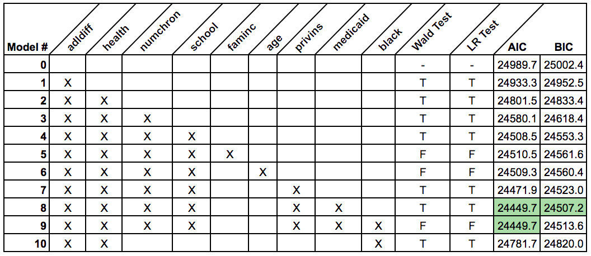

```{r echo = F, include = F}
library(MASS)
library(pscl)
library(lmtest)
library(broom)
library(knitr)
setwd("~/6622-Project")
load('DebTrivedi')
df <- DebTrivedi[ , c(1, 7:19)]
remove(DebTrivedi)

if (!is.logical(df$adldiff)){
## adldiff
df$adldiff <- as.logical(as.numeric(df$adldiff) - 1)

## black
df$black <- as.logical(as.numeric(df$black) - 1)

## gender (true = male, name change to male instead of gender)
df$gender <- as.logical(as.numeric(df$gender) - 1)

## married
df$married <- as.logical(as.numeric(df$married) - 1)

## employed 
df$employed <- as.logical(as.numeric(df$employed) - 1)

## privins 
df$privins <- as.logical(as.numeric(df$privins) - 1)

## medicaid 
df$medicaid <- as.logical(as.numeric(df$medicaid) - 1)

# change name of gender to male
varnames <- names(df)
varnames[8] <- 'male'
names(df) <- varnames
}

var <- c('health', 'adldiff', 'region', 'age', 'male', 'black', 
          'married', 'school', 'faminc', 'employed', 'privins', 'medicaid')
form <- as.formula(paste('ofp ~', paste(var, collapse = ' + ')))

numeric_sum <- read.csv("numeric summary.csv")
cat_sum <- read.csv("Cat Summary Table.csv")
```

### Is a Zero-Inflated model appropriate?
In cases where there are a higher number of zero's than expected observed in the response variable, it is appropriate to consider a zero inflated model. Zero inflated models are a two-component mixture model combining a point mass at zero with a count distribution (E.g. Poisson, Negative Binomial). There are then two sources of zeros: from either the point mass or the count model. 

Zero inflated are typically used when there is another process outside of what is accounted in the original model that causes a response value of zero.
For example, in predicting the number of insurance claims submitted for a particular risk (e.g. flood), the counts may be zero inflated by those people who have not taken out an insurance policy for that particular risk and are therefore unable to submit a claim. The mixture model therefore has two components.

$\ Pr(y_{j} = 0) = \pi + (1-\pi)f(0)$
$\ Pr(y_{j} = h) = (1-\pi)f(h), \;\;\;h \ge 0$

Where $\pi$ is modeled by a binomial GLM $\pi = g^{-1}(Z^{T}\gamma)$

How does a zero-inflated model fit with our data? We examine this by fitting both a negative binomial and a zero inflated negative binomial on a subset of the most predictive variables.

```{r include = T, echo = T}
kable(numeric_sum, digits = 2)
kable(cat_sum, digits = 2)
nbfit <- glm.nb(formula = ofp ~ adldiff + health + numchron + male + school, data = df)
zerofit <- zeroinfl(formula = ofp ~ adldiff + health + numchron + male + school , data = df, dist = 'negbin')

```
Using AIC as a rough metric to evaluate model fit, we see that $AIC_{NB} = 24501.5$ and $AIC_{Zero Inf} =24386.17$.  
It is difficult to use other metrics, such as  $BIC$ or $R^2$ as these do not apply to both model types. Despite the zero inflated model having a lower AIC, we believe it is not an appropriate choice for this analysis. The description of the dataset gives no indication that the data is not iid or that there is any kind of underlying process that would induce a response of zero (other than the variables and processes that are already accounted for). Additionally, is it expected that a zero inflated model would perform as well better than its non-inflated counter part. This is due simply to the fact that is no additional zeros are observed (beyond what is expected) the zero inflated model simply sets $\pi$ close to zero and it simplifies to an ordinary negative binomial model.

Following from this conclusion, the remainder of our model with focus on the use of the negative binomial mode.

### Variable Selection 
Starting with our base model of only the intercept $ofp \sim 1$ we will attempt to find the optimal model through. the incremental addition of the nine candidate parameters:  
1. adldiff  
2. health  
3. numchron  
4. school  
5. faminc  
6. age  
7. privins  
8. medicaid  
9. black  


#### Attempt adding adldiff to the model
```{r echo = T, include = T}
nb0 <- glm.nb(ofp ~ 1, data = df)
nb1 <- update(nb0, . ~ . + adldiff)

#Likelihood Ratio (LR) Test
-2*(logLik(nb0) - logLik(nb1)) > 3.84

#Wald Test
abs(coef(nb1)[2] / sqrt(summary(nb1)$cov.unscaled[2,2])) > 1.96
```
The variable passes both the LR and Wald tests, so we will include it.

#### Attempt adding health to the model
```{r echo = T, include = T}
nb2 <- update(nb1, . ~ . + health)

#Likelihood Ratio (LR) Test
-2*(logLik(nb1) - logLik(nb2)) > 3.84

#Wald Tests (one for each of the two factor levels)
abs(coef(nb2)[3] / sqrt(summary(nb2)$cov.unscaled[3,3])) > 1.96
abs(coef(nb2)[4] / sqrt(summary(nb2)$cov.unscaled[4,4])) > 1.96
```
As with the $adldiff$ variable, $health$ also passes both the LR and Wald tests and will therefore be included in the model.

We continue adding variables in this manner. Both $numchron$ and $school$ pass LR and Wald tests when added.
```{r echo = T, include = T}
nb3 <- update(nb2, . ~ . + numchron)
nb4 <- update(nb3, . ~ . + school)
```
However, $faminc$ does not pass either test when added to the model that already contains the previously mentioned variables.
#### Attempt adding faminc to the model
```{r echo = T, include = T}
nb5 <- update(nb4, . ~. + faminc)

# LR Test
2*(logLik(nb4)) - 2*logLik(nb5) > 3.84

#Wald Test
abs(coef(nb5)[7] / sqrt(summary(nb5)$cov.unscaled[7,7])) > 1.96
```
We can continue in this way, sequentially adding variables to the model and keeping them if they pass both tests. The results are given in the table below.



We see that the age, faminc and black variables failed to make it into the model. As the model adds more an more parameters, it becomes more difficult to pass the Wald & LR tests for significance. This is evidenced by the black variables failing to achieve significance when there are alrady 6 other variables in the model (Model #9) but when added to a simpler model (Model #10) it does. It is for this reason that simply adding variables one at a time and rejecting those that fail significance is not the most reliable route for building a predictive model; the order in which the variables are added matters.

To select the best of the 10 candidate models, AIC and BIC values were calculated. We see that Model #8: $ofp \sim adldiff + health + numchron + school + privins + medicaid$ has the best scores for both AIC and BIC. 

